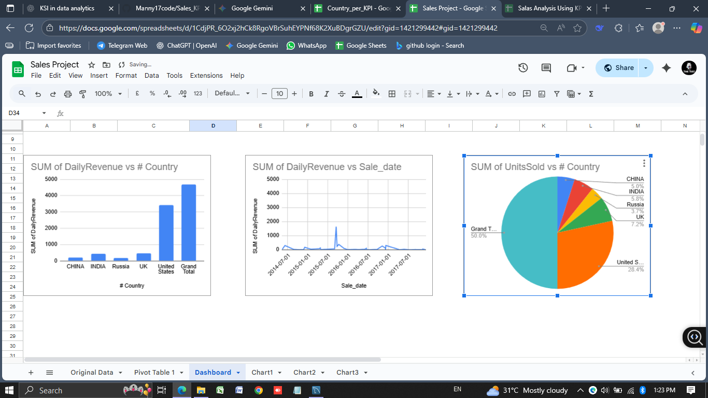

# Sales KPI Analaysis
Sales Analytics Using My SQL and Google sheets

## Project Summary
Analyzed raw sales data using My Sql to calculate key performance indicators and identify profit  across different countries.

## Tools Used
* MySQL (Data Aggregation and Analysis)
* Google Sheets (Visualization and Reporting)

## SQL Analysis & Data Aggregation
### Final Sql Quarry
'''SQL
CREATE SCHEMA ecom_analysis_db;

Use ecom_analysis_db;
Create table Salesdata (
    Order_ID int,
    Country VARCHAR (50),
    Order_Date date,
    Quantity int,
    Profit decimal
);

ALTER TABLE SalesData
MODIFY COLUMN Order_ID VARCHAR(50);

select
country,
convert(Order_Date,CHAR(50)) AS Sale_date,
sum(profit) as Daily_profit,
sum(Quantity) as Daily_sale,
sum(profit) /sum(Quantity) As Profit_Per_Unit

From salesdata
Group By
country,
Sale_date 
Order by
country,
Sale_date;

## Key Visualizations and Insights 

### Chart 1

